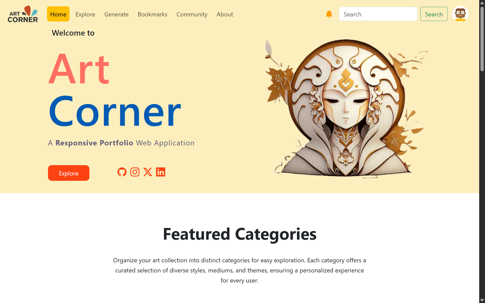
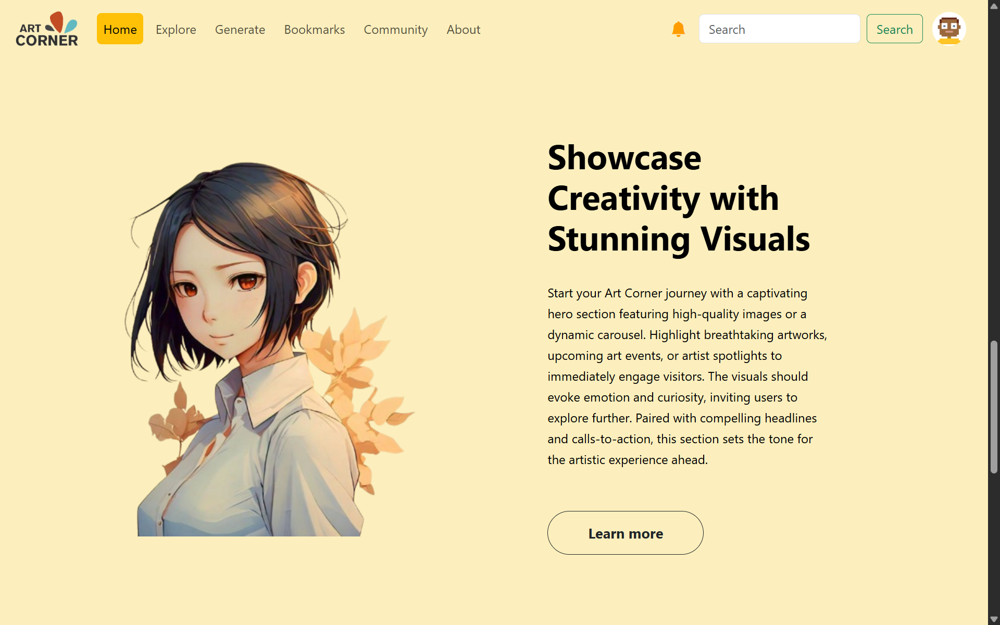
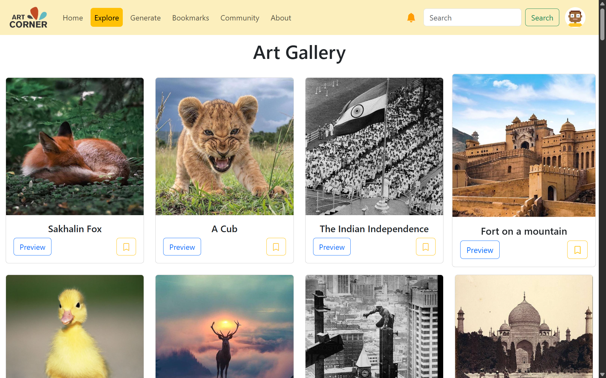
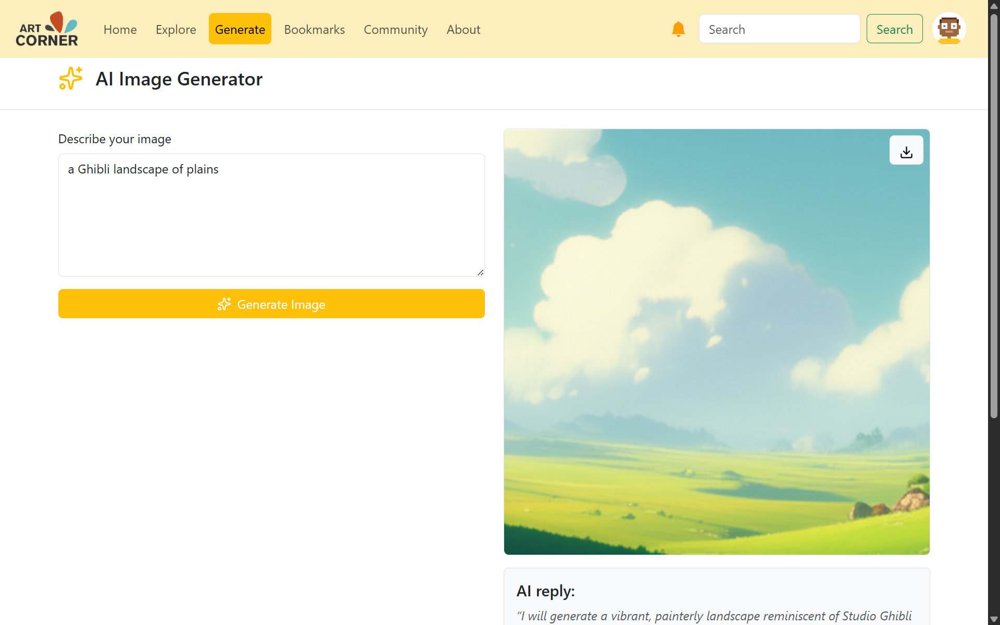
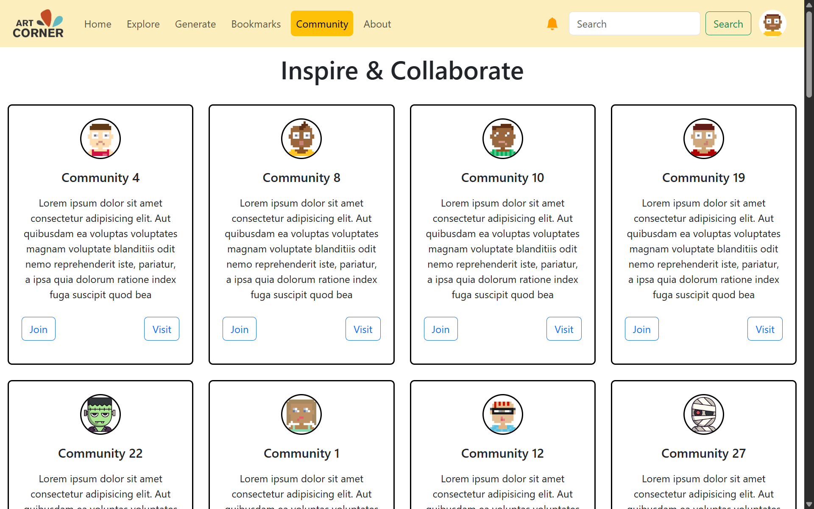
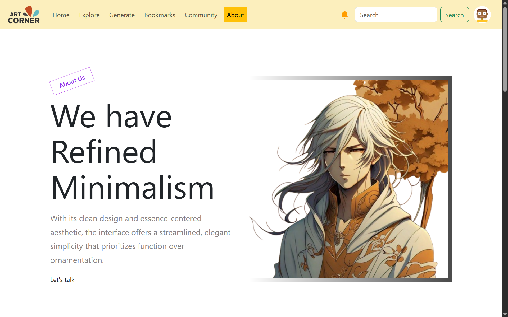
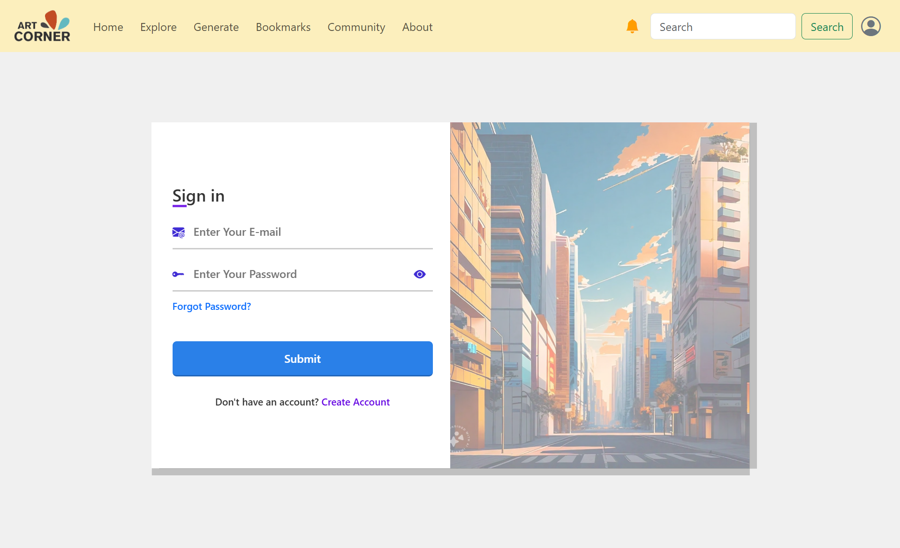
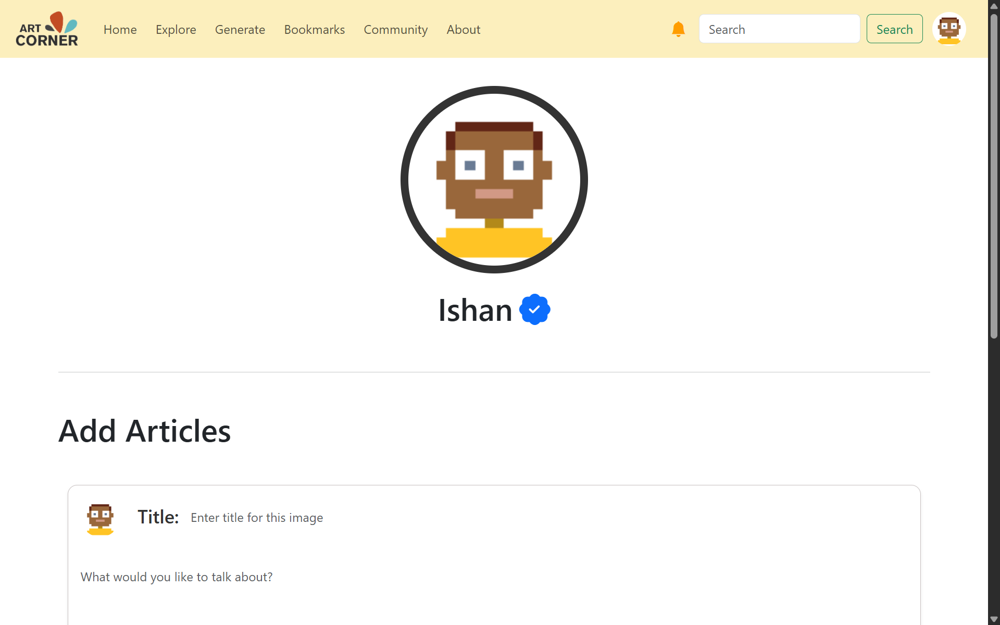

# 🎨 ArtCorner

A full-stack AI-powered image generation platform where users can create digital art from text prompts, post their creations (called **artifacts**), explore artwork by others, and download images — all in one seamless experience.

---

## 🚀 Live Site

🔗 [Visit ArtCorner](https://artcornerjs.vercel.app)

---

## 📸 Features

- 🧠 Generate unique images using text prompts
- 🖼️ Upload and share your images as **artifacts**
- 🔍 Browse the Explore page to view community-generated art
- ⬇️ Download any public artifact
- ⚡ Responsive UI/UX with instant feedback and smooth animations

---

## 🛠️ Tech Stack

### Frontend
- **Next.js** (React + App Router)
- **Tailwind CSS** for styling
- **Deployed on Vercel**

### Backend
- **Express.js** API
- **MongoDB** with Mongoose ODM
- **Deployed on Render**

### DevOps
- **GitHub** for version control
- **CI/CD** via GitHub + Vercel/Render integrations

---

## 🖼️ Screenshots

- 


- 


- 


- 


- 


- 


- 


- 

---

## 🌐 Project Architecture

```
artcornerjs/
├── client/               # Next.js frontend
│   ├── pages/            # App routes
│   ├── components/       # Reusable UI
│   └── public/           # Static assets
├── server/               # Express backend
│   ├── routes/           # API endpoints
│   ├── controllers/      # Business logic
│   └── models/           # MongoDB models
```

---

## 🔒 Security Features

- HTTPS via Vercel & Render
- Protected API endpoints
- Input validation on prompt/image uploads

---

## 📜 License

This project is licensed under the [MIT License](LICENSE).

---

## 👨‍💻 Author

Built by [Ishan Dwivedi](https://github.com/Ishan1012)  
For collaboration or questions, feel free to open an issue or reach out!
